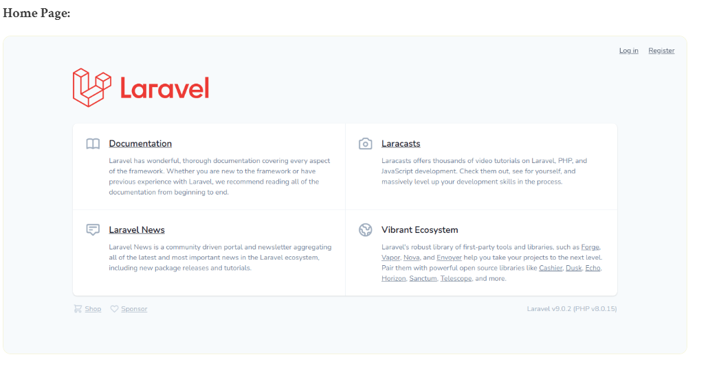

# laravel9_react_js_auth_scaffolding
## 1. Install Laravel 9
```Dockerfile
composer create-project laravel/laravel laravel9_react_js_auth_scaffolding
```
## 2.Install Laravel UI
```Dockerfile
composer require laravel/ui
```
- install laravel ui package
```Dockerfile
php artisan ui react
OR
php artisan ui react --auth
```
- install npm
```Dockerfile
npm install && npm run dev
```
- Chạy migration command
```Dockerfile
php artisan migrate
```
## 3. Run Laravel App:
```Dockerfile
php artisan serve
```
- Vào http://localhost:8000/




- Bạn có thể thấy ảnh chụp màn hình dưới đây mà laravel ui tạo js và thiết lập thành phần:


